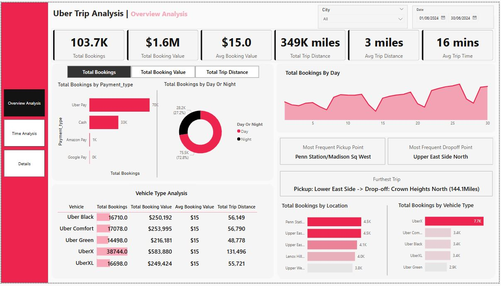
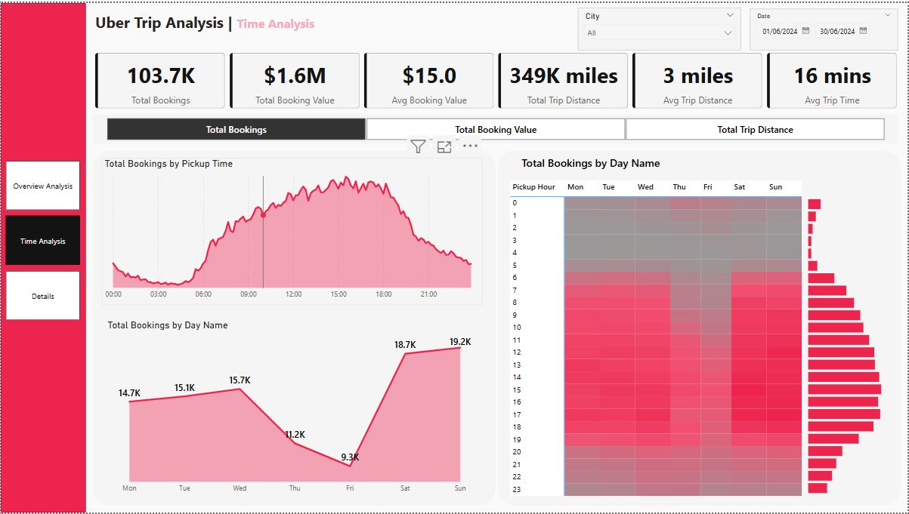
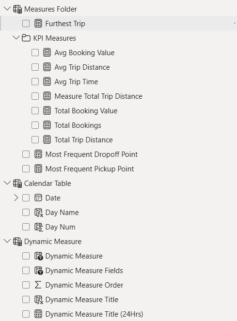

# Introduction

This report provides a comprehensive, data-driven analysis of Uber trip activity and operational performance across the selected region (All) for the period June 1st, 2024, to June 30th, 2024.

This project utilizes a structured dataset to power a dashboard that allows stakeholders to monitor real-time and historical performance across key dimensions.

The data can be found in the data folder it consists of two excile files that I have linked together in a model for analysis.

There were many cleaning and transformations steps such as connecting different tables together, creating measures and more performed to produce this analysis and interactive dashboard. Most of the cleaning and transformations where done in power query, you can view the some measures created [here](visuals/Measures.JPG) and some of the queries [here](visuals\Trip_Details_Queries.JPG).
- Note day hours are 6AM in the morning to 6PM in the evening

The dataset used is made of multiple tables joined together in a [model](visuals/Model.JPG).

# Executive Summary

Overall performance for June 2024 was robust, characterized by a high volume of 103.7K Total Bookings generating $1.6M in Total Booking Value. The average trip was short and efficient, clocking in at 3 miles with an average duration of 16 mins.

 Performance is characterized by a significant bias toward late-day demand and the UberX tier. 70% of all bookings occurred during the day hours, suggesting operational demand is highly concentrated inside of standard business hours.

Critically, UberX is the primary driver of both volume and revenue, accounting for 38.7K bookings (highest volume) and 

# Insights Deep Dive

1) Demand Skew: Day vs. Night Bookings

What is the proportional breakdown of bookings by time of day, and how does this affect operational planning?

The proportional split reveals a highly skewed demand profile, with $\mathbf{70.7\%}$  of trips occurring during day hours. This strong demand concentration suggests that driver incentives and fleet deployment strategies must heavily favor the day-time window to prevent demand from exceeding supply, which could lead to increased surge pricing and potential customer dissatisfaction.

2) Vehicle Type Performance and Revenue Contribution

Which vehicle categories are the primary drivers of volume and value, and what is the market appetite for premium services?

UberX clearly dominates the market with the highest total bookings ($\mathbf{387K}$) and highest total revenue ($\mathbf{\$584K}$).

3) Geographical Demand Concentration

What are the most critical pickup and drop-off hubs, and what does the top location data reveal about trip purpose?

The data indicates two critical geographical points: **Penn Station/Madison Sq West** is the Most Frequent Pickup Point, and **Upper East Side North** is the Most Frequent Dropoff Point. This suggests a high volume of trips these two areas. The heavy booking volume in Manhattan locations (Penn Station, Upper East Side, Lenox Hill) confirms the borough remains the core operational zone.

# Recommendations

Dynamic Daytime Incentives: Given the $\mathbf{70.7\%}$ Day-time demand skew identified by the overview analysis, implement dynamic incentives for drivers working between 6 AM and 6 PM. 

With the time analysis I would also suggest higher incentives for drivers working between 12AM and 6PM since the total bookings between these time periods were all over 7000 which was not reached anywhere else. This will help maintain supply equilibrium and prevent over-reliance on surge pricing during peak hours. 

The time analysis also reveals reduced total bookings on thursdays and fridays so incentives for drivers working on those days can be reduced.

Root Cause Analysis on Long-Distance Trips: Investigate the nature of the Furthest Trip (Lower East Side $\rightarrow$ Crown Heights North, 144.1 Miles). Analyze similar outliers to determine if they represent profitable inter-city routes or if operational adjustments are needed to handle exceptionally long trips efficiently.

# Thoughts

The current dashboard provides an excellent foundation, but expanding the time series analysis to include the full calendar year of 2024 would allow for the development of more accurate predictive models for seasonal demand. Additionally, it would be highly valuable to integrate external data, such as weather patterns or major event schedules, to further refine the operational optimization recommendations.

- Here are the measures used.

